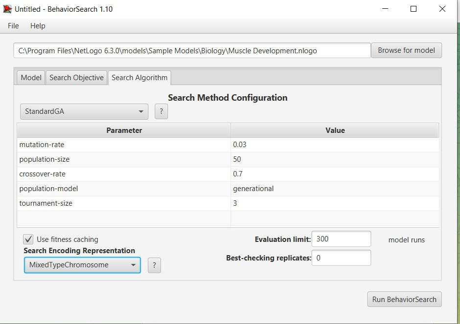

## Комп'ютерні системи імітаційного моделювання
## СПм-22-5, **Тимошенко Дар'я Олександрівна**
### Лабораторна робота №**3**. Використання засобів обчислювального интелекту для оптимізації імітаційних моделей

 

### Варіант 12, модель у середовищі NetLogo:
[MuscleDevelopment](https://github.com/dariatymoshenko/KCIM_lab1/blob/main/README.md)

 

### Налаштування середовища BehaviorSearch:

**Обрана модель**:
<pre>
C:\Program Files\NetLogo 6.3.0\models\Sample Models\Biology\Muscle Development.nlogo
</pre>
**Параметри моделі** (вкладка Model):  
<pre>
["days-between-workouts" [1 1 30]]
["hours-of-sleep" [0 0.5 12]]
["intensity" [50 1 100]]
["lift?" true false]
["%-slow-twitch-fibers" [0 1 100]]

</pre>
Використовувана **міра**:  
Для фітнес-функції  було обрано **значення суми розмірів м'язових волокон**, вираз для її розрахунку взято з налаштувань графіка аналізованої імітаційної моделі в середовищі NetLogo  
  
та вказано у параметрі "**Measure**":
<pre>
muscle-mass
</pre>
Сума розмірів м'язових волокон повинна враховуватися **в максимальній** за весь період симуляції тривалістю, , 500 тактів , починаючи з 0 такту симуляції.  
Параметр зупинки за умовою ("**Stop if**") у разі не використовувався.  
Загальний вигляд вкладки налаштувань параметрів моделі:  

**Налаштування цільової функції** (вкладка Search Objective):  
Метою підбору параметрів імітаційної моделі, що описує ріст мускулів, є **максимізація** значення суми розмірів м'язових волокон – це вказано через параметр "**Goal**" зі значенням **Maximize Fitness**. Тобто необхідно визначити такі параметри налаштувань моделі, у яких сума розмірів м'язових волокон є максимальною. При цьому цікавить не просто  сума розмірів м'язових волокон у якийсь окремий момент симуляції, а максимальне її значення за всю симуляцію (тривалість якої (100 кроків) вказувалася на минулій вкладці). Для цього у параметрі "**Collected measure**", що визначає спосіб обліку значень обраного показника, вказано **MAX_ACROSS_STEPS**.  
Щоб уникнути викривлення результатів через випадкові значення, що використовуються в логіці самої імітаційної моделі, **кожна симуляція повторюється по 10 разів**, результуюче значення розраховується як **середнє арифметичне**.
Загальний вигляд вкладки налаштувань цільової функції:  

**Налаштування алгоритму пошуку** (вкладка Search Algorithm):  
Загальний вид вкладки налаштувань алгоритму пошуку:  

 

### Результати використання BehaviorSearch:
Діалогове вікно запуску пошуку:  

Результат пошуку параметрів імітаційної моделі, використовуючи **генетичний алгоритм**:  

Результат пошуку параметрів імітаційної моделі, використовуючи **випадковий пошук**:  

Робота моделі у середовищі NetLogo з парметрами:

